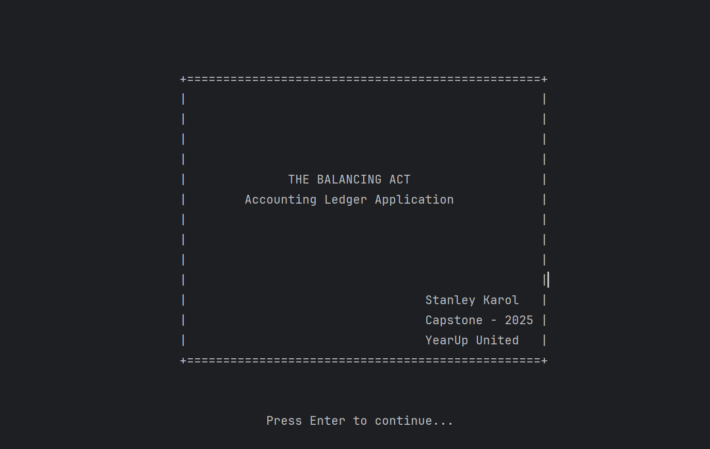
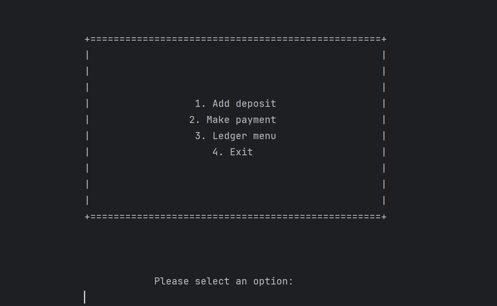
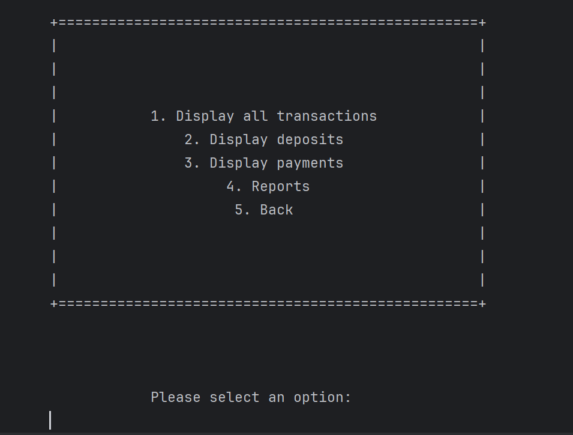
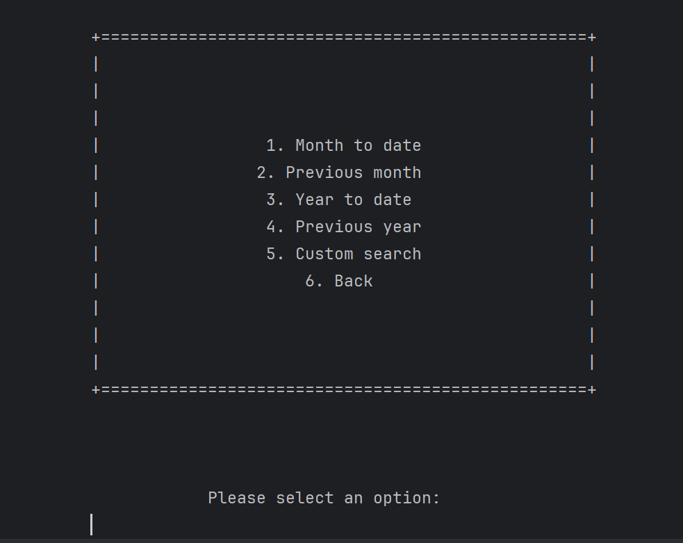

# The Balancing Act - Accounting Ledger Application

This is a console-based accounting ledger application written in Java. It allows users to track income (deposits) and
expenses (payments) by recording transactions, which are persistently stored in a CSV file.

## Project Description

"The Balancing Act" provides a simple, menu-driven command-line interface for managing personal finances. Users can add
new transactions, view lists of existing transactions filtered by type (all, deposits, payments), and generate various
financial reports based on date ranges (e.g., Month-to-Date, Year-to-Date, Custom Search). All transaction data is read
from and saved to a local CSV file (`data/transactions.csv` by default), making it easy to view or manipulate the data
outside the application if needed.

## Features

* **Transaction Management:** Add deposits and payments with date, time, description, vendor, and amount details.
* **Data Persistence:** Transactions are saved to a CSV file (`data/transactions.csv`) for persistence between
  application runs.
* **Ledger Viewing:** Display lists of all transactions, only deposits, or only payments.
* **Reporting:** Generate reports for specific periods:
    * Month-To-Date
    * Previous Month
    * Year-To-Date
    * Previous Year
* **Custom Search:** Filter transactions based on start/end date, description, vendor, and/or amount.
* **Console Interface:** User-friendly menu system for navigation and data entry.
* **Formatted Output:** Transactions and reports are displayed in a clean, tabular format in the console.

## How it Works

The application uses a layered structure:

1. **UI Layer:** Handles console input and output, displaying menus, prompting for user input, and displaying formatted
   data.
2. **Service Layer:** Coordinates application flow (`BalancingAppCoordinator`) and orchestrates actions like adding
   transactions or performing searches (`TransactionService`).
3. **Repository Layer:** Manages data access. `CsvTransactionRepository` implements the `TransactionRepository`
   interface, handling the reading and writing of `Transaction` objects to/from the configured CSV file.
4. **Model Layer:** Defines the data structure for a `Transaction`.
5. **Configuration:** `AppConfig` loads settings like the CSV file path from `application.properties`.
6. **Utilities:** Provide helper functions for console I/O, file handling, data type management (`BankBigDecimal`), and
   screen formatting.

Data is stored in a pipe-delimited CSV file (`|`), typically located at `data/transactions.csv`.

## Application Screens (Console Output Examples)

**1. Welcome Screen:**
**2. Home Menu:** 
**3. Ledger Display:** 
**4. Report Menu:** 

## Interesting Code Snippet:

```java
public class BalancingAppCoordinator {

    //other methods and fields

    public static void homeScreenFlow() {
        while (true) {
            HomeScreen.print();
            int option = ScreenUtils.askForMenuOptionsInput(HomeScreen.amountOfOptions());
            performAction(option, HomeScreen.MenuOption.class);
        }
    }

    public static void ledgerScreenFlow() {
        while (true) {
            LedgerScreen.print();
            int option = ScreenUtils.askForMenuOptionsInput(LedgerScreen.amountOfOptions());
            performAction(option, LedgerScreen.MenuOption.class);
        }
    }

    public static void reportScreenFlow() {
        while (true) {
            ReportScreen.print();
            int option = ScreenUtils.askForMenuOptionsInput(ReportScreen.amountOfOptions());
            performAction(option, ReportScreen.MenuOption.class);
        }
    }

    public static <T extends Enum<T> & MenuEntry> void performAction(int option, Class<T> menu) {
        T menuOption = Arrays.stream(menu.getEnumConstants())
                .filter(entry -> entry.getValue() == option)
                .findFirst()
                .orElse(null);
        if (menuOption != null) {
            ScreenUtils.cls();
            menuOption.getAction().run();
        } else {
            System.out.println("Invalid option. Please try again.");
        }
        ScreenUtils.waitTillPressEnter();
        ScreenUtils.cls();
    }

    //other methods and fields
}
```
Menu options are defined in the `HomeScreen`, `LedgerScreen`, and `ReportScreen` classes. Each screen has its own, similar to that:
``` java
  public enum MenuOption implements MenuEntry {
        ADD_DEPOSIT(1, "Add deposit", TransactionService::addDeposit),
        MAKE_PAYMENT(2, "Make payment", TransactionService::makePayment),
        LEDGER_MENU(3, "Ledger menu", BalancingAppCoordinator::ledgerScreenFlow),
        EXIT(4, "Exit", BalancingAppCoordinator::exit);

        private final int value;
        private final String name;
        private final Runnable action;
        //other fields and methods
```

### How it works:
1. in the method `homeScreenFlow()`, the menu is printed, and the user is prompted to select an option.
2. The selected option is passed to the `performAction()` method, which used to find the corresponding enum constant in the `MenuOption` enum.
3. If a valid option is found, the associated action (a method reference) is executed.

### Advantages of this approach:
- **Separation of Concerns:** The menu logic is separated from the action logic, making it easier to maintain and extend.
- **Flexibility:** New menu options can be added easily by adding new enum constants and their corresponding actions.
- **Type Safety:** Using enums provides compile-time type safety, reducing the risk of errors due to invalid option values.
 

